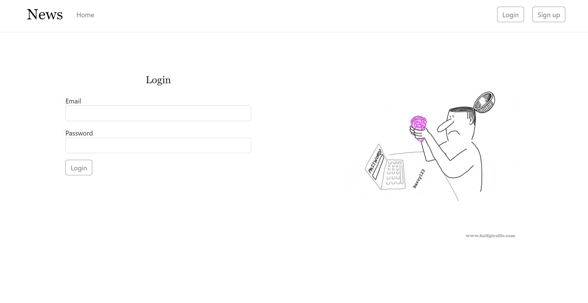
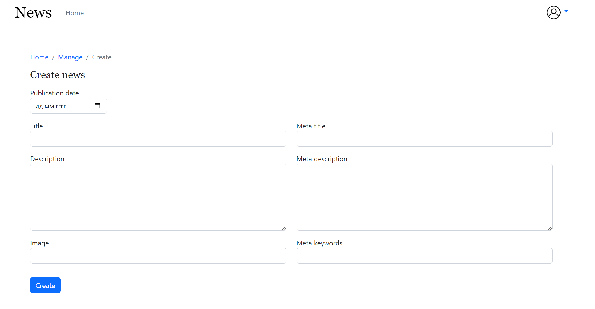

# CRUD Приложение "Новостной сайт"

Привет! Добро пожаловать в CRUD-приложение "Новостной сайт". Это приложение предоставляет базовый функционал для управления новостями и обратной связью.

## Особенности приложения

- Административный раздел с авторизацией/регистрацией для управления новостями и обратной связью.
- Публичный раздел с пагинированным списком новостей.
- Детальные страницы новостей с формой обратной связи.
- Система отправки заявок на почту и сохранение в БД.
- Меню и "хлебные крошки" для удобной навигации.
- Мета-тэги для страниц новостей с возможностью редактирования через админку.
- Валидация вводимых данных для безопасности.

## Установка

1. Клонируйте репозиторий: `git clone git@github.com:ViktoriaSharifullina/NewsPortal.git`
2. Перейдите в директорию проекта: `cd your-repo`
3. Установите зависимости: `composer install`
4. Скопируйте `.env.example` в `.env` и настройте базу данных и параметры почтового сервера.
5. Сгенерируйте ключ: `php artisan key:generate`
6. Выполните миграции: `php artisan migrate`
7. Запустите сервер: `php artisan serve`

## Использование

### Административный раздел

1. Зарегистрируйтесь или авторизуйтесь в административной части.
2. В административной части вы можете создавать, редактировать и удалять новости.
3. Также есть возможность просмотреть и удалить заявки на обратную связь.

### Публичный раздел

1. Перейдите на главную страницу, чтобы увидеть список новостей с пагинацией.
2. Нажмите на новость, чтобы перейти на детальную страницу.
   
### Детальная страница новости

1. На странице новости есть форма обратной связи.
2. После заполнения формы, заявка отправится на указанный почтовый адрес и будет сохранена в БД.

## Интерфейс

